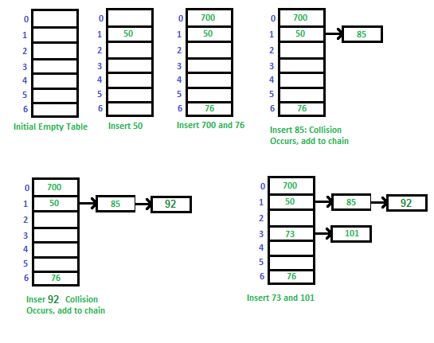

# :memo: Hashing :memo:
---

## Introduction

---
For arrays and linked lists, we need to search in a linear fashion, which can be costly in practice. If we use arrays and keep the data sorted, then a phone number can be searched in O(Logn) time using Binary Search, but insert and delete operations become costly as we have to maintain sorted order. 

With balanced binary search tree, we get moderate search, insert and delete times. All of these operations can be guaranteed to be in O(Logn) time. 

---
## Why to use Hashing?
--- 

If you observe carefully, in a balanced binary search tree, if we try to search , insert or delete any element then the time complexity for the same is O(logn). Now there might be a situation when our applications want to do the same operations in a faster way i.e. in a more optimized way and here hashing comes into play. In hashing, all the above operations can be performed in O(1) i.e. constant time. It is important to understand that the worst case time complexity for hashing remains O(n) but the average case time complexity is O(1).

Now let us understand a few basic operations of hashing.....

---
### Basic Operations:
---

- <ins>HashTable</ins>: This operation is used in order to create a new hash table.
- <ins>Delete</ins>: This operation is used in order to delete a particular key-value pair from the hash table.
- <ins>Get</ins>: This operation is used in order to search a key inside the hash table and return the value that is associated with that key.
- <ins>Put</ins>: This operation is used in order to insert a new key-value pair inside the hash table.
- <ins>DeleteHashTable</ins>: This operation is used in order to delete the hash table.

---
### Hashing Components:
---

1. Hash Table: An array that stores pointers to records corresponding to a given phone number. An entry in hash table is NIL if no existing phone number has hash function value equal to the index for the entry.  In simple terms, we can say that hash table is a generalization of array. Hash table gives the functionality in which a collection of data is stored in such a way that it is easy to find those items later if required. This makes searching of an element very efficient.

<br>

2. Hash Function: A function that converts a given big phone number to a small practical integer value. The mapped integer value is used as an index in hash table. So, in simple terms we can say that a hash function is used to transform a given key into a specific slot index. Its main job is to map each and every possible key into a unique slot index. If every key is mapped into a unique slot index, then the hash function is known as a perfect hash function. It is very difficult to create a perfect hash function but our job as a programmer is to create such a hash function with the help of which the number of collisions are as few as possible. Collision is discussed ahead.
        A good hash function should have following properties:

    - Efficiently computable. 
    - Should uniformly distribute the keys (Each table position equally likely for each).
    - Should minimize collisions.
    - Should have a low load factor(number of items in table divided by size of the table).                                                  
    - For example for phone numbers a bad hash function is to take first three digits. A better function is consider last three digits. Please note that this may not be the best hash function. There may be better ways. 

<br>

3. Collision Handling : Since a hash function gets us a small number for a big key, there is possibility that two keys result in same value. The situation where a newly inserted key maps to an already occupied slot in hash table is called collision and must be handled using some collision handling technique. Following are the ways to handle collisions: 


    - Chaining : The idea is to make each cell of hash table point to a linked list of records that have same hash function value. Chaining is simple, but requires additional memory outside the table.

    
    
    - Open Addressing: In open addressing, all elements are stored in the hash table itself. Each table entry contains either a record or NIL. When searching for an element, we examine the table slots one by one until the desired element is found or it is clear that the element is not in the table.
        - Linear Probing: In linear probing, we search for an empty slot in the hash table by going to the next slot.
        - Quadratic Probing: In quadratic probing, we search for an empty slot in the hash table by going to the slot at (hash(key) + i<sup>2</sup>) % tableSize. Here i is the number of collisions.
        - Double Hashing: In double hashing, we search for an empty slot in the hash table by going to the slot at (hash1(key) + i*hash2(key)) % tableSize. Here hash2() is a secondary hash function and i is the number of collisions.

 ```c
    #include <stdio.h>
    #include <stdlib.h>
    #include <string.h>
    #include <stdbool.h>

    #define TABLE_SIZE 10

    typedef struct HashEntry {
        int key;
        int value;
    } HashEntry;


    typedef struct HashTable {
        int size;
        int count;
        HashEntry **entries;
    } HashTable;


    HashTable *createHashTable(int size) {
        HashTable *table = malloc(sizeof(HashTable));
        table->size = size;
        table->count = 0;
        table->entries = malloc(sizeof(HashEntry *) * table->size);

        for (int i = 0; i < table->size; i++) {
            table->entries[i] = NULL;
        }

        return table;
    }


    int hashFunction(int key) {
        return key % TABLE_SIZE;
    }


    void insert(HashTable *table, int key, int value) {
        HashEntry *entry = malloc(sizeof(HashEntry));
        entry->key = key;
        entry->value = value;

        int hashIndex = hashFunction(key);

        while (table->entries[hashIndex] != NULL) {
            hashIndex++;
            hashIndex %= TABLE_SIZE;
        }

        table->entries[hashIndex] = entry;
        table->count++;
    }


    HashEntry *search(HashTable *table, int key) {
        int hashIndex = hashFunction(key);

        while (table->entries[hashIndex] != NULL) {
            if (table->entries[hashIndex]->key == key) {
                return table->entries[hashIndex];
            }

            hashIndex++;
            hashIndex %= TABLE_SIZE;
        }

        return NULL;
    }


    void delete (HashTable *table, int key) {
        int hashIndex = hashFunction(key);

        while (table->entries[hashIndex] != NULL) {
            if (table->entries[hashIndex]->key == key) {
                HashEntry *temp = table->entries[hashIndex];

                table->entries[hashIndex] = NULL;
                free(temp);
                table->count--;
                return;
            }

            hashIndex++;
            hashIndex %= TABLE_SIZE;
        }

        printf("Element not found");
    }


    void display(HashTable *table) {
        for (int i = 0; i < table->size; i++) {
            if (table->entries[i] != NULL) {
                printf(" (%d, %d)", table->entries[i]->key, table->entries[i]->value);
            } else {
                printf(" ~~ ");
            }
        }

        printf("\n");
    }


    int main() {
        HashTable *table = createHashTable(TABLE_SIZE);

        insert(table, 1, 20);
        insert(table, 2, 70);
        insert(table, 42, 80);
        insert(table, 4, 25);
        insert(table, 12, 44);
        insert(table, 14, 32);
        insert(table, 17, 11);
        insert(table, 13, 78);
        insert(table, 37, 97);

        display(table);

        HashEntry *entry = search(table, 37);

        if (entry != NULL) {
            printf("Element found: %d\n", entry->value);
        } else {
            printf("Element not found\n");
        }

        delete (table, 37);
        entry = search(table, 37);

        if (entry != NULL) {
            printf("Element found: %d\n", entry->value);
        } else {
            printf("Element not found\n");
        }

        display(table);

        return 0;
    }
```
Output:

```
 (1, 20) (2, 70) (42, 80) (4, 25) (12, 44) (14, 32) (17, 11) (13, 78) (37, 97) ~~
Element found: 97
Element not found
 (1, 20) (2, 70) (42, 80) (4, 25) (12, 44) (14, 32) (17, 11) (13, 78) ~~ ~~

